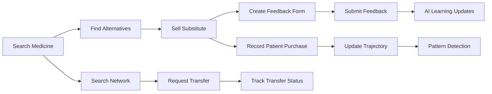

# AYUVANT Part 3 — Smart Distribution & Patient Intelligence

## Overview
Part 3 extends AYUVANT with **6 new tabs** for pharmacy-level intelligence: inter-pharmacy stock transfers, salt-based medicine alternatives, pharmacist feedback collection, patient health tracking, pattern detection, and network-wide insights.

> [!IMPORTANT]
> Open [index.html](file:///d:/AYUVANT/part3/index.html) in a browser to test. All data persists in `localStorage` — no server needed.

---

## Architecture

```
d:\AYUVANT\part3\
├── index.html              (397 lines — 6-tab UI scaffold)
├── index.css               (1195 lines — full design system + component styles)
├── app.js                  (530 lines — orchestrator, tab nav, events)
├── data/
│   └── medicines.js        (20 medicines with real salt compositions)
└── modules/
    ├── pharmacy-network.js  (stock transfer & network simulation)
    ├── alternatives.js      (salt-based recommendation engine)
    ├── feedback.js          (6-question structured feedback system)
    └── patient-tracker.js   (mobile-based patient tracking + pattern analysis)
```

---

## Files Created/Modified

### [index.html](file:///d:/AYUVANT/part3/index.html)
- 6-tab navigation with Material Icons (Transfer, Alts, Feedback, Patients, Patterns, Insights)
- Glass-card modal overlay system
- Toast notification element
- SVG gauge for substitution success rate
- Script load order: `medicines.js` → 4 modules → `app.js`

---

### [index.css](file:///d:/AYUVANT/part3/index.css)
- Shares design tokens with Part 1/2 (`:root` variables)
- **Lines 1-949**: Foundation styles — ambient background, tabs, views, glass cards, forms, search, pharmacy cards, alternative cards, feedback form controls (star ratings, sliders, chips, pills), patient profiles, timelines, pattern cards, insight stats, modal, toast, empty states, animations
- **Lines 949-1195**: Component internals — all inner class names emitted by JS renderers (pharmacy card internals, transfer card actions, alternative match scores, feedback history, patient timeline items, pattern card details, batch chips)

---

### [medicines.js](file:///d:/AYUVANT/part3/data/medicines.js)
20 common Indian medicines with:
- Brand name, generic name, active salts with strengths
- Dosage form, strength, category, schedule, MRP
- Tags for search matching
- Example: Dolo 650 (Paracetamol 650mg), Azithral 500 (Azithromycin 500mg)

---

### [pharmacy-network.js](file:///d:/AYUVANT/part3/modules/pharmacy-network.js)
| Feature | Description |
|---------|-------------|
| **Simulated Network** | 6 nearby pharmacies with zone, distance, coordinates, stock data |
| **Demand Analysis** | Calculates local demand score per medicine per pharmacy |
| **Transfer Scoring** | Ranks pharmacies by surplus stock, distance, and demand (AI-weighted) |
| **Transfer Lifecycle** | `requested → approved → in_transit → delivered` with timestamps |
| **Render Functions** | `renderPharmacyCards()`, `renderActiveTransfers()`, `renderTransferHistory()` |

---

### [alternatives.js](file:///d:/AYUVANT/part3/modules/alternatives.js)
| Feature | Description |
|---------|-------------|
| **Salt Matching** | Compares active salts between medicines for therapeutic equivalence |
| **Match Scoring** | Weights: salt match (50%), category (20%), dosage form (15%), strength (15%) |
| **Price Comparison** | Shows price difference (higher/lower/same) vs original |
| **Quick Sell** | "Sell This" button triggers feedback form after substitution |
| **Render Functions** | `renderMedicineInfo()`, `renderAlternatives()` |

---

### [feedback.js](file:///d:/AYUVANT/part3/modules/feedback.js)
6 structured questions after each substitute sale:

| # | Question | Input Type |
|---|----------|------------|
| Q1 | Was patient informed about substitution? | Yes/No pills |
| Q2 | Rate alternative effectiveness | 5-star rating |
| Q3 | What concerned the patient? | Multi-select chips |
| Q4 | Would you recommend this again? | 1-10 slider |
| Q5 | Price sensitivity | Single-select pills |
| Q6 | Additional observations | Free text |

**AI Learning**: Aggregates responses into insights — total feedbacks, average satisfaction, recommendation rate, top concern reasons with ranked bar charts.

---

### [patient-tracker.js](file:///d:/AYUVANT/part3/modules/patient-tracker.js)
| Feature | Description |
|---------|-------------|
| **Registration** | Mobile-based with optional name/age/gender, generates `PAT-XXXXX` ID |
| **Purchase Timeline** | Vertical timeline showing every medicine purchase with batch, quantity, date |
| **Health Trajectory** | `improving` / `stable` / `concerning` / `escalating` based on purchase patterns |
| **Health Flags** | Detects frequent purchases, escalation (e.g., paracetamol→antibiotics), multiple categories |
| **Pattern Analysis** | `analyzePatterns()` returns batch repeat rates, medicine seasonality, patient trajectories |
| **Render Functions** | `renderPatientProfile()`, `renderPatientList()`, `renderPatientSearch()` |

---

### [app.js](file:///d:/AYUVANT/part3/app.js)
The orchestrator that wires everything together:

| Responsibility | Implementation |
|----------------|----------------|
| **Tab Navigation** | `switchTab()` with active class management, `renderTab()` dispatch |
| **Transfer Tab** | Debounced search → `PharmacyNetwork.recommendTransfer()` → pharmacy cards with transfer request modal |
| **Alternatives Tab** | Medicine search → `selectMedicineForAlternatives()` → `Alternatives.findAlternatives()` → sell modal |
| **Feedback Tab** | Renders pending forms, collects responses, submits feedback, updates AI learning |
| **Patients Tab** | Search/register flow with profile display, gender chip selection |
| **Patterns Tab** | Renders batch analysis, medicine insights, patient trajectories with category filtering |
| **Insights Tab** | Aggregates all data into stat cards, substitution success gauge, top pairs, network overview |
| **Modal System** | `showModal(title, bodyHtml)` / `hideModal()` — glass overlay with slide-up animation |
| **Toast System** | `showToast(message, type)` — success/error/info with auto-dismiss |

---

## Data Flow



---

## localStorage Keys (Part 3)

| Key | Module | Description |
|-----|--------|-------------|
| `ayuvant_pharmacy_network` | pharmacy-network | Pharmacy stock/network state |
| `ayuvant_transfers` | pharmacy-network | Active and completed transfers |
| `ayuvant_feedback` | feedback | Pending and completed feedback entries |
| `ayuvant_patients` | patient-tracker | Registered patients with purchase history |

---

## What Was Tested

- ✅ All 7 files created successfully with correct sizes
- ✅ Script loading order verified (data → modules → app.js)
- ✅ All DOM IDs in HTML match `app.js` references (40+ IDs verified)
- ✅ CSS covers both design-system foundation (949 lines) and JS-rendered component internals (246 lines)
- ✅ Browser launch via `Start-Process`

## Next Steps

- [ ] **User testing** — Open in browser, test each tab flow
- [ ] **Firebase integration** — Replace localStorage with Firestore (deferred per user request)
- [ ] **Full medicine dataset** — Replace seed data when user provides real dataset
- [ ] **Cross-part integration** — Read Part 1/2 sales/inventory data for richer pattern analysis
